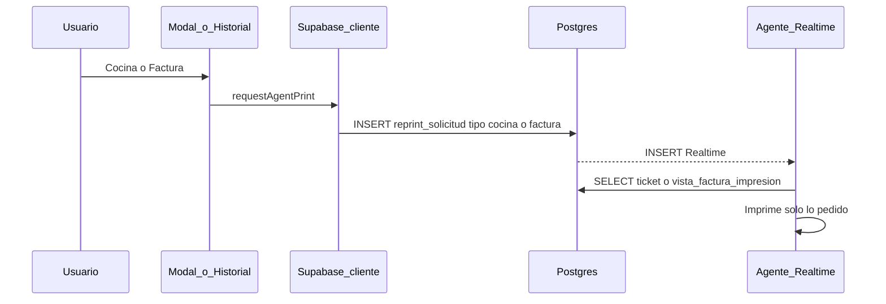

# Modal de reimpresión en el POS

Describe el modal **Reimprimir** y cómo se alinea con el **agente que escucha Supabase Realtime** (sin `POST` HTTP al PC del local).

## Dónde está en la app

- **Botón:** barra superior del POS (ícono impresora, “Reimprimir” en pantallas anchas).
- **Modal:** [`ReprintPOSModal.tsx`](../src/features/pos/components/ReprintPOSModal.tsx)
- **Historial:** [`HistorialPedidosView.tsx`](../src/features/pedidos/view/HistorialPedidosView.tsx)

## Flujo (base de datos → Realtime)

**Cocina y factura** usan el mismo mecanismo: **`INSERT` en `reprint_solicitud`** con `tipo = 'cocina'` o `tipo = 'factura'` ([`reprintViaRealtime.ts`](../src/features/impresion/reprintViaRealtime.ts)). El trigger valida pedido FACT y, si es factura, que exista factura no anulada.

El agente debe escuchar **INSERT** en `reprint_solicitud` y, según `tipo`, imprimir **solo cocina** o **solo factura** (ver [`AGENTE_REPRINT_SOLICITUD.md`](AGENTE_REPRINT_SOLICITUD.md)).

Migraciones: [`14_reprint_solicitud.sql`](../database/14_reprint_solicitud.sql) y, si usás RPC `bump_factura_reprint`, [`15_bump_factura_reprint_solicitud.sql`](../database/15_bump_factura_reprint_solicitud.sql).

Código: [`agentPrintClient.ts`](../src/features/impresion/agentPrintClient.ts) y [`reprintViaRealtime.ts`](../src/features/impresion/reprintViaRealtime.ts).

## Permisos (RLS)

`reprint_solicitud` tiene políticas para `INSERT`/`SELECT` del tenant del usuario. Si falla, revisá la migración 14.

RPC opcionales: [`13_bump_reprint_realtime.sql`](../database/13_bump_reprint_realtime.sql) (versión antigua). Tras 14 y 15, `bump_pedido_reprint_cocina` y `bump_factura_reprint` encolan en `reprint_solicitud` (no hacen `UPDATE` en pedidos/facturas para reimprimir).

## Qué no hace

- No usa `/api/agent/print` ni `fetch` a `agent_ip` para reimprimir.
- No duplica pedidos ni ítems.
