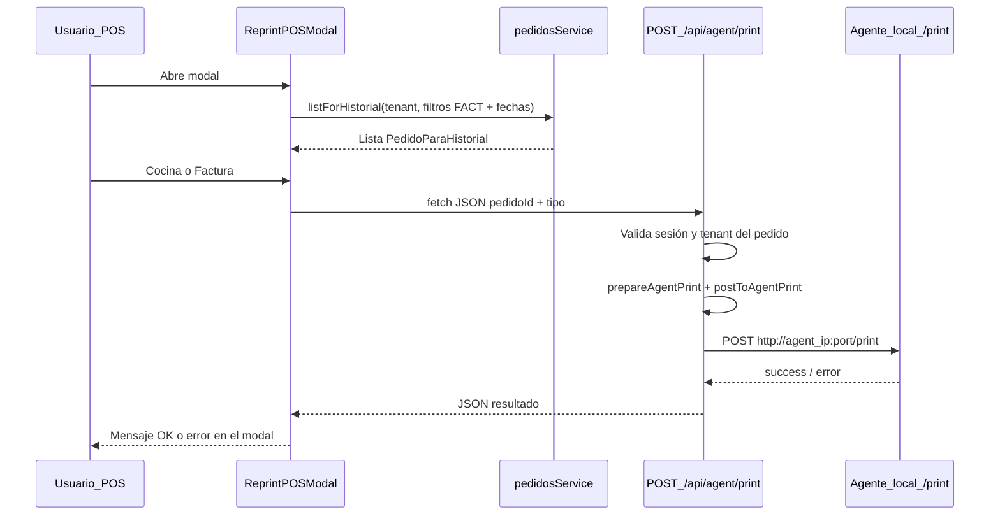

# Modal de reimpresión en el POS

Este documento describe cómo funciona el modal **Reimprimir** del punto de venta: qué datos usa, qué llama al backend y cómo se relaciona con el agente de impresión.

## Dónde está en la app

- **Botón:** barra superior del POS, junto a Canje / Historial / Administración. Ícono de impresora y texto “Reimprimir” en pantallas anchas.
- **Componente del modal:** [`src/features/pos/components/ReprintPOSModal.tsx`](../src/features/pos/components/ReprintPOSModal.tsx)
- **Vista POS:** [`src/features/pos/view/POSView.tsx`](../src/features/pos/view/POSView.tsx) (estado `reprintModalOpen` y render de `ReprintPOSModal`)

Cualquier usuario que **puede entrar al POS** (admin, cajero, repartidor según [`POSPageClient.tsx`](../src/app/home/pos/POSPageClient.tsx)) ve el botón. No depende del historial de pedidos ni de su visibilidad por rol.

## Objetivo del modal

Permitir **volver a imprimir** sin crear pedidos nuevos:

1. **Cocina:** ticket armado desde `pedidos` + `vista_items_ticket_cocina` + tenant + cliente (mismo contrato HTTP que el agente espera con `tipo: "cocina"`).
2. **Factura:** solo si existe factura **no anulada** para ese pedido; payload `tipo: "factura"`.

La lógica de armado del JSON y el `fetch` al agente vive en el servidor ([`src/app/api/agent/print/route.ts`](../src/app/api/agent/print/route.ts) y [`src/features/impresion/agentPrintServer.ts`](../src/features/impresion/agentPrintServer.ts)).

## Flujo paso a paso

### 1. Apertura y carga inicial

Al abrirse el modal:

- Se reinician mensajes de feedback y error de lista.
- Se aplican filtros por defecto: **últimos 7 días**, **estado FACT** (solo confirmados), sin filtro de número.
- Se llama a `pedidosService.listForHistorial(tenantId, filtros)` — la misma función que usa el historial de pedidos, así que cada fila incluye `factura_imprimible` (hay fila en `facturas` y `anulada = false`).

### 2. Filtros en pantalla

El usuario puede cambiar:

- **Desde / Hasta** (fechas)
- **Nº pedido** (opcional; si coincide con un número, filtra ese pedido)

Al pulsar **Buscar pedidos** se vuelve a ejecutar `listForHistorial` con los filtros actuales (sigue forzado `estado_pedido: 'FACT'` en el estado inicial del modal; el usuario no cambia el estado en el modal — siempre se lista en modo “confirmados” vía `defaultReprintFilters()` y el objeto `filters` mantiene `estadoPedido: 'FACT'`).

### 3. Acciones por pedido

Para cada ítem de la lista se renderiza [`ReprintOrderActions`](../src/features/pedidos/components/ReprintOrderActions.tsx):

- **Cocina:** siempre habilitado para `estado_pedido === 'FACT'`.
- **Factura:** deshabilitado si `factura_imprimible` es false (sin factura o anulada).

Mientras una petición está en curso, los botones del pedido se deshabilitan y se muestra spinner en el botón activo (`printingKey` = `pedidoId:cocina` o `pedidoId:factura`).

### 4. Llamada desde el navegador

El modal no habla con el agente directamente. Usa [`requestAgentPrint`](../src/features/impresion/agentPrintClient.ts):

- `POST /api/agent/print` con cuerpo `{ pedidoId, tipo: 'cocina' | 'factura' }`.
- Cookies de sesión (`credentials: 'same-origin'`) para que el Route Handler identifique al usuario y su `tenant_id`.

### 5. Qué hace el Route Handler

1. Comprueba autenticación y tabla `usuarios`.
2. **`prepareAgentPrint`:** lee el pedido (debe ser del mismo tenant y `estado_pedido = 'FACT'`), `printer_config` activo, y según el tipo arma el body para el agente (cocina o factura).
3. **`postToAgentPrint`:** hace `fetch` a `http://{agent_ip}:{agent_port}/print` con timeout (~20 s).
4. Devuelve `{ success, message }` o error (502 si el agente no responde, 400 si falta impresora/factura, etc.).

### 6. Feedback al usuario

- **Lista:** errores de Supabase al cargar pedidos se muestran arriba de la lista.
- **Impresión:** mensaje verde (éxito) o rojo (error del API/agente) debajo de los filtros.

## Código compartido con el historial

- **Lista + flags de factura:** `pedidosService.listForHistorial` y tipo `PedidoParaHistorial`.
- **Botones Cocina/Factura:** componente `ReprintOrderActions`.
- **Cliente HTTP:** `requestAgentPrint` en `agentPrintClient.ts`.

El **historial de pedidos** sigue teniendo sus propias columnas/botones; el modal del POS es una entrada alternativa sin depender de la ruta `/home/pedidos`.

## Red y despliegue

El **servidor Next** es quien llama al `agent_ip` de `printer_config`. Tiene sentido si Next corre en la misma red LAN que la PC del agente. Si la app está en un hosting que **no alcanza IPs privadas**, la impresión por este camino fallará hasta que la red o el despliegue lo permitan (ver comentarios en el route handler).

## Base de datos relevante

- `pedidos` (FACT), `vista_items_ticket_cocina` (ítems + modificaciones; migración [`database/12_vista_items_ticket_notas.sql`](../database/12_vista_items_ticket_notas.sql) agrega `notas_item` si aún no la aplicaste en Supabase).
- `printer_config` (URL del agente y `printer_id`).
- `facturas` + `vista_factura_impresion` para reimpresión fiscal.

## Qué no hace el modal

- No inserta pedidos duplicados.
- No actualiza `pedidos.updated_at` para disparar Realtime (eso sería otra estrategia, opcional y con cuidado con triggers).
- No modifica el código del agente; solo envía el mismo contrato `POST /print` que ya soporta.
